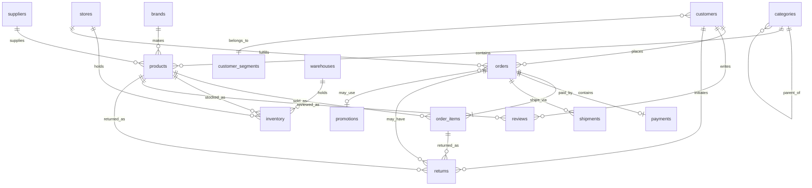

# Contoso Tech - Retail Data Model

Fictional consumer electronics retailer. Sells laptops, phones, TVs, gaming, smart home, and accessories. Online store + physical retail locations.

## Architecture Overview

```
┌──────────────────────────────────────────────────────────────┐
│                       Source Systems                          │
├──────────────────────┬──────────────────┬────────────────────┤
│  Azure SQL           │   Cosmos DB      │   Event Hub        │
│  (OLTP - canonical)  │  (operational)   │   (streaming)      │
│                      │                   │                    │
│  • customers         │  • cart_sessions  │  • clickstream     │
│  • products          │  • wishlists      │                    │
│  • orders            │                   │                    │
│  • inventory         │                   │                    │
│  • payments          │                   │                    │
│  • shipments         │                   │                    │
│  • returns           │                   │                    │
│  • reviews           │                   │                    │
└──────────────────────┴──────────────────┴────────────────────┘
                           │
                           ▼
┌──────────────────────────────────────────────────────────────┐
│                  ADLS Gen2 (Bronze / Raw)                     │
│  Mirrored SQL/Cosmos + raw clickstream parquet               │
└──────────────────────────────────────────────────────────────┘
                           │
                           ▼
┌──────────────────────────────────────────────────────────────┐
│               Fabric Lakehouse (Silver / Gold)                │
│  Cleaned, conformed, dimensional models for reporting        │
└──────────────────────────────────────────────────────────────┘
                           │
                           ▼
┌──────────────────────────────────────────────────────────────┐
│                    Power BI Dashboards                        │
│  Executive overview, sales, inventory, customers, ops        │
└──────────────────────────────────────────────────────────────┘
```

## Entity-Relationship Diagram



## Tables (Azure SQL)

### Identity & Customers

**`customer_segments`** - Reference data: Consumer, Small Business, Enterprise, Education

**`customers`** - Shoppers (PII: email, name, phone, DOB, address)

### Product Catalog

**`categories`** - Hierarchical: Electronics > Computers > Laptops (self-referencing)

**`brands`** - Manufacturers (Microsoft, Apple, Samsung, Dell, etc.)

**`suppliers`** - Where we source from (brand direct or distributors)

**`products`** - SKUs with pricing, dimensions, warranty, lifecycle dates

### Locations

**`warehouses`** - Distribution centers

**`stores`** - Physical retail locations (Flagship / Standard / Outlet)

**`inventory`** - Stock per location (warehouse OR store) with reorder logic

### Transactions

**`orders`** - Order headers with channel (online/store/mobile), shipping address snapshot

**`order_items`** - Line items with unit price, discounts, fulfillment source

**`payments`** - Payment transactions (credit card, paypal, apple pay, store credit)

**`shipments`** - Fulfillment tracking (carrier, tracking number, status)

**`returns`** - Returned items with reason and refund details

### Marketing & Engagement

**`promotions`** - Discount codes / campaigns

**`reviews`** - Product reviews (rich text data for AI/sentiment demos)

See [schema.sql](schema.sql) for full DDL.

## Cosmos DB Containers

**`cart_sessions`** - In-progress shopping carts
- Partition key: `/customer_id`
- TTL: 7 days

**`wishlists`** - Customer wishlists
- Partition key: `/customer_id`

See [cosmos-containers.json](cosmos-containers.json) for definitions.

## Event Hub Streams

**`clickstream_events`** - Web/mobile browsing
```json
{
  "event_id": "uuid",
  "event_type": "page_view | product_view | add_to_cart | search | checkout_start | purchase",
  "customer_id": 12345,
  "session_id": "sess_xyz",
  "timestamp": "2026-05-26T14:23:00.123Z",
  "page_url": "/products/laptop-pro-15",
  "product_id": 567,
  "search_query": null,
  "referrer": "google.com",
  "device_type": "desktop | mobile | tablet",
  "user_agent": "..."
}
```

See [event-schemas/](event-schemas/) for full event JSON schemas.

## Data Sensitivity Classification (for Purview)

| Data | Classification |
|---|---|
| customer email, name, phone, DOB, address | **PII** (Personal) |
| card_last_four | **PII** (Financial) |
| order totals, payment amounts | **Financial** |
| supplier costs, product cost | **Confidential** |
| reviews | **Public** (user-generated) |
| product catalog | **Public** |
| inventory levels | **Internal** |

## Why This Design

- **Star-schema friendly**: easy to project into Fabric Gold layer for Power BI
- **Multi-channel**: online + retail store data shows omnichannel analytics
- **Rich text (reviews)**: enables NLP/sentiment demos with Azure AI
- **Time-series (clickstream, inventory)**: streaming analytics demos
- **Sensitive data mix**: drives Purview classification + data masking stories
- **Realistic complexity**: returns, promotions, multi-location inventory mirror real retail
